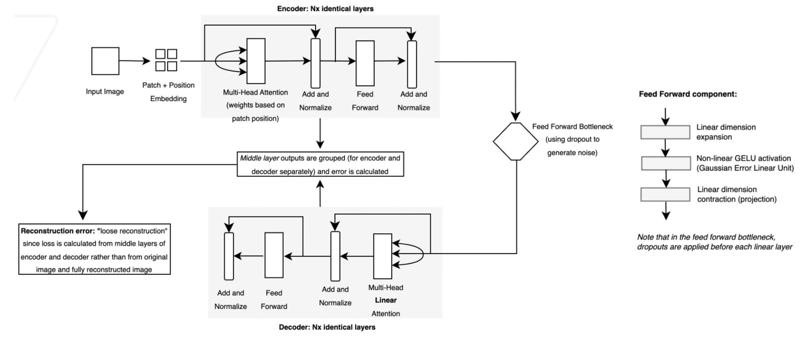

# anomaly-detection-project
Practicum project for my MS Data Analytics program @ Georgia Tech

The goal of my team’s Practicum project was to develop an unsupervised anomaly detection method with high enough [precision and specificity] to be implemented in our sponsoring company's manufacturing facilities (our sponsor for the project was Novelis, a leading manufacturer and recycler of aluminum). Several machine learning methods were tested; the one I focused on was a transformer architecture because they tend to be accurate and although typically slower than ML methods like auto-encoders, there have been recent advancements that have made them more practical in industrial anomaly detection settings. My transformer work involved building upon a recently published transformer architecture with class-leading high performance metrics and relatively fast inference speed. The flowchart shows the major processes:

